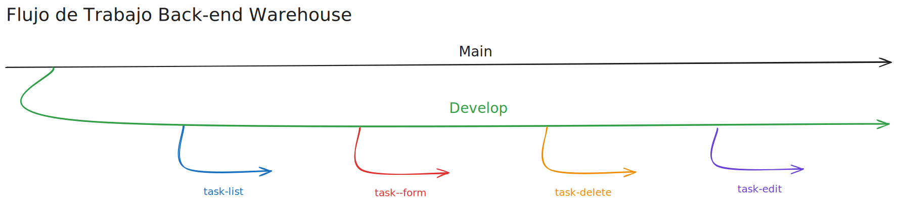
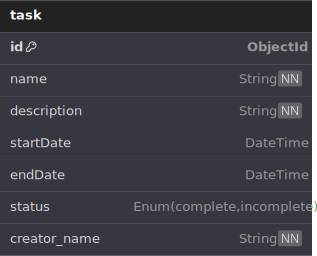

# Warehouse_Company (In Development)

## Important

Hey devs your scrum here! make sure you read this carefully before you start development,
this will be an application that will keep track of tasks on a warehouse, as it will be only one entity in the database the workflow will be the same in both front end and backend, here is a description of each feature branch and also the database entity we will be working on.

## Feature Branches

`feature/task-list`

Branch to develop the task list component (TaskList).

`feature/task-form`

Branch to develop the form to add tasks.

`feature/task-delete`

Branch to develop the delete task functionality

`feature/task-edit`

Branch to develop the edit and mark tasks as done functionalities

## Database Schema

